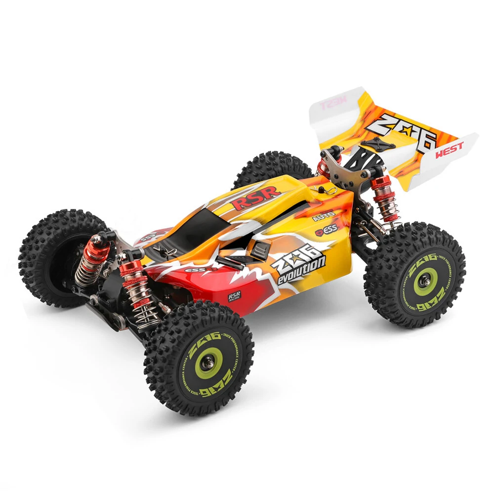

# donkeycar-blue


[Donkeycar](https://www.donkeycar.com/) software v5.1

## Vehicle Hardware Setup
BOM

| Component | Where to buy | Specifications	| Comments |
|:---	|:---	|:---	|:---	|
| Chassis: Wltoys 144010 1/14 	| [Banggood](https://www.banggood.com/de/Wltoys-144010-1-or-14-2_4G-4WD-High-Speed-Racing-Brushless-RC-Car-Vehicle-Models-75km-or-h-p-1933541.html?cur_warehouse=CZ) ~120,00€ | RC Car Chassis, brushless motor, receiver and ESC are different parts   	| 	|
| Compute: Raspberry Pi 4, 8MB | [Berrybase](https://www.berrybase.de/raspberry-pi-4-computer-modell-b-8gb-ram) ~80,00€	|   	|	|
| Memory: SD Card  	|   	|   	|	|
| Network: Wifi Stick	|   	|   	|	|
| Camera: Raspi Cam 	|   	|   	|	|
| Controller: PS4 Dualshock 	|   	|   	|	|
| USB Receiver: 8BitDo 	|   	|   	|	|

3d printed pars from [Thingiverse](https://www.thingiverse.com/thing:2566276)

## Vehicle Software Setup
Follow Instructions [get Raspberry PI working](https://docs.donkeycar.com/guide/robot_sbc/setup_raspberry_pi/):

### Step 1: Install Raspberry Pi OS 
* get [Rasberry Pi Imager (for Mac)](https://downloads.raspberrypi.org/imager/imager_latest.dmg)
* Create SD Card with 'Raspberry Pi OS (64 bit) (Bookworm)'
 * host name:  donkeycar-blue
 * user: donkey
 * password: DonkeyCar
 * locale settings: Berlin
 * keyboard layout: en

### Step 1a: Configure SSH
on your Mac type in the follwoing commands. Don't set a password for the SSH key. 
```
# mac
mkdir ~/.ssh/donkeycar-blue
ssh-keygen -t ed25519 -C "broerkens@gmail.com"
ssh-copy-id -i ~/.ssh/donkeycar-blue/id_ed25519 donkey@donkeycar-blue.local
```

configure new SSH key for donkeycar-blue.local. Open ssh config file
```
# mac
nano ~/.ssh/config 
```

and add the following text

```
Host donkeycar-blue.local
    IdentityFile ~/.ssh/donkeycar-blue/id_ed25519
```

### Step 2: Update and Upgrade
```
# vehicle
sudo apt-get update --allow-releaseinfo-change
sudo apt-get upgrade
```

### Step 2a: Fix Raspberry Pi Camera:
You have to run the following commands AFTER update of the system.

#### Increase timeout:

```
# vehicle
sudo nano /usr/share/libcamera/pipeline/rpi/vc4/rpi_apps.yaml
```

add

```
"camera_timeout_value_ms": 10000
```


#### Fix permissions of libcamera
```
# vehicle
sudo nano /etc/udev/rules.d/raspberrypi.rules
```

add

```
SUBSYSTEM=="dma_heap", GROUP="video", MODE="0660"
```

reboot vehicle or run: 
```
# vehicle
udevadm control --reload-rules && udevadm trigger
```

As long as your non-privledged user is in the 'video' group then libcamera will not produce the dma_heap error message.

### Step 3: Raspi-config
```
# vehicle
sudo raspi-config
```

* Enable Interfacing Options - I2C
* Select Advanced Options - Expand Filesystem so you can use your whole sd-card storage
* Do not enable the legacy camera (it's disabled by default, so don't change anything)


### Step 4: Setup virtual environment
#### Virtual env
To create a virtual environmnet run the following from your home directory:

```
# vehicle
python3 -m venv env --system-site-packages
echo "source ~/env/bin/activate" >> ~/.bashrc
source ~/.bashrc
```

#### Install required libraries

```
# vehicle
sudo apt install libcap-dev libhdf5-dev
```

### Step 5: Install Donkeycar Python Code

```
# vehicle
pip install donkeycar[pi]==5.1
```

### Step 6: Install Custom vehicle `donkeycar-blue``
```
# vehicle
cd ~
mkdir cars
cd cars
git clone git@github.com:MarkBroerkens/donkeycar-blue.git
cd donkeycar-blue
cd car_mark
```

## Vehicle Calibration
calibrate steering
```
# vehicle
donkey calibrate --pwm-pin PCA9685.1:40.1 #steering
```

```
# vehicle
donkey calibrate --pwm-pin PCA9685.1:40.0 #throttle
```

## (optional) Install Wifi hotspot
Follow instructions at https://raspap.com/#quick

* IP Addreess: http://10.9.141.1/ http://donkeycar-blue/
* Username: admin
* Password: secret
* DHCP range: 10.9.141.50 — 10.9.141.254
* SSID: donkeycar-blue
* Password: ChangeMe

## PC setup on Mac M1
### Install Conda. 

These four commands quickly and quietly install the latest M1 macOS version of the installer and then clean up after themselves. To install a different version or architecture of Miniconda for macOS, change the name of the .sh installer in the curl command. see [docs](https://docs.anaconda.com/free/miniconda/)

```
# mac
mkdir -p ~/miniconda3
curl https://repo.anaconda.com/miniconda/Miniconda3-latest-MacOSX-arm64.sh -o ~/miniconda3/miniconda.sh
bash ~/miniconda3/miniconda.sh -b -u -p ~/miniconda3
rm -rf ~/miniconda3/miniconda.sh
```

After installing, initialize your newly-installed Miniconda. The following commands initialize for bash and zsh shells:

```
# mac
~/miniconda3/bin/conda init bash
~/miniconda3/bin/conda init zsh
```

Setup your `donkey` conda env with:

```
# mac
conda create -n donkey python=3.11
conda activate donkey
```


### Install TensorFlow with hardware acceleration

Install donkeycar v5.2.dev2 software (v5.1 runs into errors)
```
# mac
pip install tensorflow==2.15.1
pip install tensorflow-metal
mkdir devel
cd devel
git clone https://github.com/autorope/donkeycar
cd donkeycar
git checkout f81750d
pip install -e .\[pc\]
```

(replace `git checkout f81750d` by `git checkout main` if you want to use the latest version)


### Install dependencies for `makemovie`
```
# mac
brew install ffmpeg
pip install moviepy
```


### Install `donkeycar-blue`


## Start driving
### On vehicle
#### Clean data

```
# mac
ssh donkey@donkeycar-blue.local
```

```
# mac
cd ~/devel/donkeycar-blue/car_mark/data
rm -rf * 
```

#### Start driving
```
# vehicle
cd ~/cars/donkeycar-blue/car_mark/
python manage.py drive models/mypilot.tflite --type tflite_linear --js
```

### Train
[Train autopilot](https://docs.donkeycar.com/guide/deep_learning/train_autopilot/)
```
--model ~/mycar/models/mypilot.tflite --type tflite_linear
```

### On Mac M1 Host PC
```
# mac
http://donkeycar-blue.local:8887/drive
```

```
# mac
cd ~/devel/donkeycar-blue/car_mark
donkey ui
```
